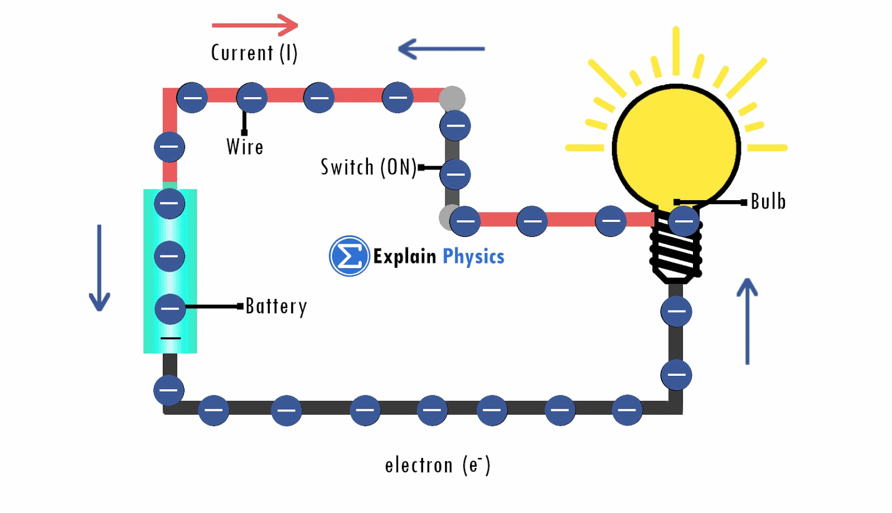
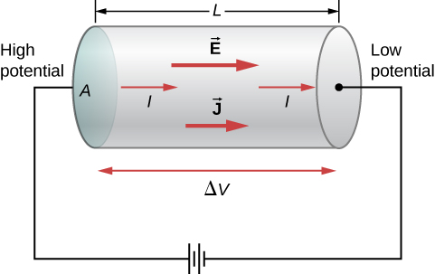

```{r setup, include=FALSE}
knitr::opts_chunk$set(message=FALSE,warning=FALSE, cache=TRUE)
```

A fim de esclarecer e facilitar o entendimento do assunto principal deste trabalho, será feita uma breve revisão sobre resistência elétrica, tensão elétrica, corrente elétrica e Lei de Ohm.


# Tensão elétrica

Diferença de potencial e voltagem são outras formas de falar de tenção elétrica. Tensão elétrica é a grandeza física que mede a diferença de potencial elétrico entre dois pontos
O instrumento utilizado para medir a tensão elétrica é o voltímetro e no Sistema Internacional (SI) a unidade de medida é o volt, cujo símbolo é V.

$~$


# Corrente elétrica

Corrente elétrica é o fluxo coordenado das carga elétrica, na existência uma diferença de potencial elétrico entre as extremidades. Sendo o sentido real do fluxo, contrário ao sentido da corrente elétrica (I). Assim, de acordo com o sentido convencional, as cargas vão do pólo positivo para o negativo, o que na verdade não se verifica no sentido real, como mostrado na figura abaixo.


<center>
<a href = "https://images.app.goo.gl/5V4iYn1yMsiGVPGw9">
{width=65%}
</a>
</center>

$~$

# Lei de Ohm

*Georg Simon Ohm* (1789 – 1854) foi um físico alemão que descobriu que a intensidade de corrente elétrica que atravessa certos condutores é diretamente proporcional à sua diferença de potencial (voltagem) e inversamente proporcional à sua resistência, formulando assim uma lei física conhecida como lei de Ohm.


<center> Definindo a Lei de Ohm:  </center>
$$
I=\frac {V}{R}
$$
onde:

- I = Corrente elétrica
- V = Diferença de potencial
- R = Resistência


$~$


## Fórmula Matemática
**Como calcular a corrente elétrica (demonstração da fórmula)?** 

A corrente elétrica (i) por unidade de área transversal (A) define o módulo do vetor densidade de corrente (J).


$$
J = \frac{I}{A} \hspace{1cm} (1)
$$

Já a corrente elétrica é definida como o fluxo total das cargas (Q) por unidade de tempo (Δt). Sendo basicamente expressa como: 

$$
I = \frac{Q}{\Delta t} \hspace{1cm} (2)
$$
A condutividade (σ) é dada pela razão entre a densidade de corrente (J) e o campo elétrico (E), tal que: 

$$
\sigma = \frac{J}{E} \hspace{1cm} (3)
$$

Ainda mais, a condutividade (σ) também pode ser expressa como: 

$$
\sigma = \frac {n \cdot e^2 \tau}{m} \hspace{1cm} (4)
$$


Considere o segmento de um fio condutor de comprimento (L), seção transversal (A), com uma corrente (I) e densidade de corrente (J). Um esboço pode ser visto na Figura abaixo. 


<center>
<a href = "https://images.app.goo.gl/dpdEApG8DsHgQvaR8">
{width=65%}
</a>
</center>

$~$

Para um campo elétrico invariável, temos as equações **(1)** e **(2)** previamente formuladas acima. 
 

Definindo: $Q = n \cdot e \cdot Vol$
Em que:

- Q = quantidade de cargas
- n = Densidade de elétrons livres
- e = valor da carga elementar dos elétrons
- Vol = o volume do fio

A partir disso, temos: 

$$
I = n \cdot e \cdot \frac{Vol}{\Delta t} \hspace{1cm} (5)
$$
Em que:

- I é a corrente elétrica
- Número de elétrons
- e é o valor da carga elementar dos elétrons
- Vol é o volume do fio
- $\Delta t$ é a variação do tempo 


Podemos reescrever o quociente do volume pelo tempo por um produto entre a área da seção transversal do fio (A) e a velocidade (v) média dos elétrons. Tal que: 

$$
I = n \cdot e \cdot A \cdot v \hspace{1cm} (6)
$$
Uma vez que os elétrons estão em constante colisão com os íons, se torna necessária a definição de uma velocidade média. E pela segunda Lei de Newton temos:

$$
F = m \cdot a \hspace{1cm} (7)
$$
onde:

- F é força (em Netwons)
- m é massa
- a é aceleração

Analogamente, se tratando de força elétrica, podemos reescrever como $F = e \cdot E$. Onde:

- F = Força elétrica
- E= Campo elétrico
- e= carga elementar

Já a aceleração pode ser escrita como sendo $a=v/\tau$, em que $\tau$ é o tempo médio entre as colisões. 

Dessa forma, isolando a velocidade, temos: 

$$
v = \tau \cdot \frac{e \cdot E}{m} \hspace{1cm} (8)
$$
Então substituímos v na equação **(6)**, vem que:

$$
I = n \cdot e \cdot A \cdot  \left( \tau \cdot \frac{e \cdot E}{m} \right) \hspace{1cm} (9)
$$

Podemos substituir I na equação **(1)**, teremos: 

$$
J = \frac {n \cdot e \cdot A \cdot  \left( \tau \cdot \frac{e \cdot E}{m} \right)}{A}
$$

$$
J = \frac {n \cdot e^2 \tau}{m} \cdot E \hspace{1cm} (10)
$$
Podemos substituir a condutividade (σ) definida na equação **(4)**, ficamos com:

$$
J = \sigma \cdot E \hspace{1cm} (11)
$$
Finalmente, podemos reescrever essa equação de uma maneira mais conhecida: a famosa 1ª Lei de Ohm, temos: 
$$
U = R \cdot I \hspace{1cm} (12)
$$
onde:

- U é a diferença de potencial elétrico [medida em V (volts)]
- R é a resistênica [medida em Ω (ohm)]
- I é a corrente elétrica [medida em Àmpere (A)]


$~$

# Resistência Elétrica

A resistência elétrica pode ser definida como a capacidade que um corpo tem de opor-se à passagem da corrente elétrica. A unidade de medida da resistência no SI é o Ohm (Ω), sendo que representa a razão de volt/Ampére. Sendo os fatores que interferem no valor da resistência de um fio é:

- comprimento do condutor
- área da seção do condutor
- resistividade elétrica do condutor

$~$


## Fórmula Matemática
**Como calcular matemáticamente a resistência elétrica?**

Olhando a equação **(11)**, podemos substituir em J a equação **(1)**. Além disso, novamente, como o fio condutor em questão possui um campo constante ao longo do tempo, então o campo elétrico (E) será igual à tensão (U) dividida pelo comprimento do fio condutor (L). Isolando a corrente, fica: 

$$
I = \frac{\sigma \cdot A \cdot U}{L} 
$$

$$
\frac {I}{U} = \frac{\sigma \cdot A}{L} \hspace{1cm} (13)
$$

Na equação **(12)**, podemos dividir (U) em ambos os lados da igualdade, dessa forma teremos que $\frac{I}{U} = \frac{1}{R}$. Assim, podemos substituir na equação acima, tal que: 

$$
\frac {1}{R} = \frac{\sigma \cdot A}{L} \hspace{1cm} (14)
$$

Se definirmos a condutividade (σ) como sendo igual ao inverso da resistividade (ρ), teremos que:

$$
\frac {1}{R} = \frac{ \frac{1}{\rho} \cdot A}{L} \hspace{1cm} (15)
$$

Finalmente, ao isolarmos a resistência (R), chegaremos na 2ª Lei de Ohm, dada por: 

$$
R = \rho \cdot \frac{L}{A}  \hspace{1cm} (16)
$$

$^~$


# Potência Elétrica 

**O que é um Potência Elétrica?**  

A potência elétrica dispersada por um condutor pode ser conceituada como a quantidade de energia que transita por ele numa quantidade de tempo. 

No sistema internacional de medidas, a unidade de potência é o watt(W). Foi uma homenagem ao matemático James Watts, posto que ele melhorou a máquina à vapor. 

A potência determina o quanto de energia elétrica se transformou em outra energia, dentro de uma dada unidade de tempo. O exemplo clássico é quanto à potência de uma lâmpada. Se ela em um segundo transformar cem joule de eletricidade em energia luminosa, significa que sua potência elétrica de 100 W. 


$~$

## Fórmula Matemática
**Como calcular matemáticamento a potência elétrica?** 
A energia entre dois pontos de um condutor é igual ao trabalho realizado pelas cargas elétricas entre estes dois pontos, ou seja:

$$
E_{el} = \Delta q \cdot V  \hspace{1cm} (17)
$$
onde:

- $E_{el}$ = Energia Elétrica
- $\Delta q$ = Variação de carga elétrica
- V = Diferença de potencial, tensão elétrica


Pela definição vimos que potência elétrica é energia por tempo, a potência elétrica é energia elétrica por tempo:


$$
P = \frac{E_{el}}{\Delta t} \hspace{1cm} (18)
$$
Substituindo **(17)** em **(18)**, temos: 

$$
P = \frac{\Delta q \cdot V}{\Delta t} \hspace{1cm} (19)
$$
Mas, sabemos que Δq/Δt define outra grandeza física, a corrente elétrica: 

$$
I = \frac{\Delta q}{\Delta t} \hspace{1cm} (20)
$$
Substituindo **(20)** em **(19)**, temos: 

$$
P = V \cdot I \hspace{1cm} (21)
$$

E esta é a equação mais utilizada para potência elétrica. 

Mas para calcular a potência elétrica dissipada em resistores, deve-se utilizar a primeira Lei de Ohm. 


$$
I = \frac{V}{R} \hspace{0.3cm} (22) \hspace{1cm}  \therefore \hspace{1cm} V = R \cdot I \hspace{0.3cm} (23)
$$

Aplicando a equação de potência elétrica e a equação da Primeira Lei de Ohm, temos duas equações para a potência elétrica dissipada em um resistor: 

Substituindo **(22)** em **(21)**, temos: 

$$
P = V \cdot \left ( \frac{V}{R} \right ) \hspace{0.4cm} \therefore \hspace{0.4cm} P = \frac{V^2}{R} \hspace{0.4cm} (24)
$$

Substituindo **(23)** em **(21)**, temos: 

$$
P =  \left ( R \cdot I\right ) \cdot I \hspace{0.4cm} \therefore \hspace{0.4cm} P = R \cdot I^2 \hspace{0.4cm} (25)
$$

$$~$$


# Lei de Joule

Lei da física que estabelece a relação entre a corrente elétrica que percorre um condutor em determinado espaço de tempo e o calor por ele produzido. O seu nome deve-se aos estudos realizados por James Prescott Joule publicados em 1841 no *"Philosophical Magazine"*. 

Os portadores de carga livres no seu movimento sofrem colisões com os átomos da rede cristalina dos materiais, dissipando energia (W) na forma de energia térmica, de que resulta o aumento de temperatura dos componentes e condutores. O aumento de temperatura traduz-se num fluxo de energia térmica do componente/condutor para a sua vizinhança: Efeito de Joule. 


<center>
<a href = "">

</a>
</center>

A energia dissipada na resistência (resistor) (R) por uma corrente elétrica é diretamente proporcional à tensão(U) aplicada, à corrente elétrica (I) resultante e ao intervalo de tempo(Δt) durante o qual se dá a passagem da corrente.

$~$


## Fórmula Matemática
**Como calcular matemáticamente a Lei de Joule?**

O Resistor transforma a energia elétrica em energia térmica, ou seja, a potência elétrica consumida por um resistor é dissipada. Dada pela equação **(25)**.

A energia elétrica transformada em energia térmica ao fim de um intervalo de tempo Δt é dado por: 

$$
E_{el} = P \cdot \Delta t \hspace{1cm} (26)
$$

Agora, substituindo **(26)** em **(25)** temos a equação que representa a Lei de Joule:


$$
E_{el} = R \cdot I^2 \cdot \Delta t \hspace{1cm} (27)
$$
$~$


# Linhas de Transmissão 

Linha de transmissão é um sistema utilizado para transmissão de energia. Guiada de uma fonte geradora para uma carga consumidora, podendo ser uma guia de onda, um cabo coaxial ou fios paralelos ou torcidos. Cada linha Transmissão é composta de 3 fases identificadas pelas letras A, B e V que significam Azul, Branca e Vermelha, que são as 3 fases da corrente trifásica. 

A tensão de transmissão é elevada para diminuir as perdas pelo efeito Joule (o cabo esquenta pela passagem da eletricidade). Quanto mais alta a tensão, menor serão as perdas. 

A linha entre Itaipu e Tijuco Preto tem um comprimento de 700 quilômetros e a tensão é de 750.000 Volts. Mas quando chegamos próximos a centros urbanos não é seguro se operar com tensões tão elevadas. Então as linhas operam com tensão de 230.000 Volts próximo as cidades. Dentro da cidade a tensão é menor ainda. Podendo ser em 138.000 Volts ou 69.000 Volts. 

Os cabos são suspensos por torres bem altas para a segurança das pessoas e veículos que passam debaixo das linhas. As linhas formam uma "barriga" por causa do seu peso e por medidas de segurança. As torres da travessia do rio Tocantins em Tucuruí, chegam a medir 116 metros de altura. Sendo essas torres normalmente pintadas para auxiliar na navegação aérea. 


$~$


## Simulação


<iframe src="https://www.falstad.com/circuit/circuitjs.html?ctz=CQAgjOCmC0YQTAVgHSLABngDjANgOzqHzzq4gDM+4pIi6dMcAUGPhGNuPuRVgCzdyDXMnTiJkyWBhZK4kLkHpmAJxpy25LAy0hdKgO4gdIeP11dzDI3U5C6-QXttp4Zi48HX9arw8QnDxsQQmYANxMGH1MXcEVdXABOZEJEXHh8fgF8dmVwVEJ8JNwKeAIk7JLhMQpmAHNKAWCm73T9X0b+Mpbu9yRhTrt+zzczdptWdhA+gPs4mWg5CgUlXwBnVodZuIYAMwBDABt1yGYAe0VxwYskpMpadGQ5aKu6y8Rrjtv72ORyBB0SjMIA" width="800" height="400" scrolling="no" allowfullscreen></iframe>


$~$

# Referências

1. HALLIDAY, David, RESNICK, Robert, WALKER, Jearl. Fundamentos de Física - Vol. 3 - Eletromagnetismo, 10ª edição. LTC, 06/2016. VitalBook file.

2. YOUNG, Hugh; FREEDMAN, Roger - Física 3 - Eletromagnetismo. 14ª Edição 

3. EFEITO JOULE. "O que é o Efeito Joule? Fórmula e Experimento". Publicado em Abril de 2008. Disponível em: <https://efeitojoule.com/2008/04/efeito-joule/>. Acesso em: 23 de fevereiro de 2021.

4. EFEITO JOULE. "Potência Elétrica". Publicado em Junho de 2010. Disponível em: <https://efeitojoule.com/2010/06/potencia-eletrica-potencia-eletrica/>. Acesso em: 23 de fevereiro de 2021.

5. ARQUIVOS DE FÍSICA DA UFJF. "A Lei de Ohm e a Lei das malhas". Publicado em Outubro de 2013. Disponível em:< https://www.ufjf.br/fisica/files/2013/10/FIII-05-02-A-lei-de-Ohm-e-a-lei-das-malhas.pdf/> Acesso em: 24 de fevereiro de 2021.


6. ENSINO DE FÍSICA ONLINE - USP. Disponível em: <http://efisica.if.usp.br/eletricidade/basico/termo/intro/> Acesso em: 20 de fevereiro de 2021. 


