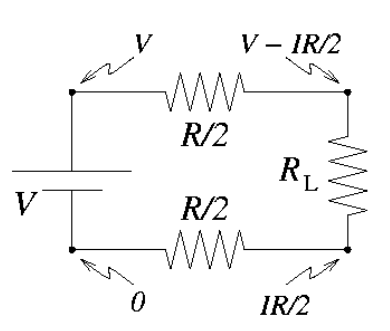

Uma usina elétrica transmite 200 MW de potência elétrica, a uma voltagem V numa distância L=500 km. As linhas de transmissão são cabos de alumínio de 2,54 cm de diâmetro.  

<a href = "https://virtual.ufmg.br/20202/pluginfile.php/445201/mod_data/intro/tema2_2.png">
{width=50%}
</a>

$~$

Dica: Para facilitar sua análise considere um circuito simples para representar o sistema de transmissão.  Encontrando a voltagem nos pontos lhe ajudará encontrar ∆V.  As resistividades do alumínio a +40 e -40°C são, 2.88x10-8 e 1.97x10-8Ω m, respectivamente.

<a href = "https://virtual.ufmg.br/20202/pluginfile.php/445201/mod_data/intro/t2dica.png">
{width=35%}

</a>

$~$

# Definindo a Resistência

(a) Encontre a resistência dos cabos quando a temperatura deles é de +40° C ou -40° C.  

Será utilizada a equação **(16)** para encontrar a resistência.

$$
R = \rho \cdot \frac{L}{A}  \hspace{1cm} (16)
$$

como, a resistividade do Alumínio é:

- $\rho_{+40ºC} = 2,88 \times 10^{-8} Ω \cdot m$
- $\rho_{-40ºC} = 1,97 \times 10^{-8} Ω \cdot m$

Área da Seção Transversal (A):

Diâmetro = 2,54 cm
Raio = 1,27 cm

$$A = \pi \cdot R^2$$
$$ A = \pi \cdot (1.27)^2 \approx 5,06 cm^2 $$
Área em $m^2 = 5,06 \cdot 10^{-4} \hspace{0.2cm} m^2$

Como são dois fios de comprimento L, será considerado nos cálculos que o comprimento é de 2L. 

Assim: 

(1) A +40ºC
$$
R_{+40ºC} = \frac{ \left ( 2,88 \times 10^{-8} Ω \cdot m \right) \cdot \left(2 \times 5 \cdot 10^5 \hspace{0.2cm} m \right)}{5,06 \cdot 10^{-4} \hspace{0.2cm} m^2} = \frac{28,80 \cdot 10^{-3} Ω \cdot m^2}{5,06 \cdot 10^{-4} \hspace{0.2cm} m^2} = 5,69 \cdot 10 Ω = 56,9 Ω
$$

(2) A -40ºC
$$
R_{-40ºC} = \frac{\left (1,97 \times 10^{-8} Ω \cdot m \right) \cdot \left(2 \times 5 \cdot 10^5 \hspace{0.2cm} m \right)}{5,06 \cdot 10^{-4} \hspace{0.2cm} m^2} = \frac{19,70 \cdot 10^{-3} Ω \cdot m^2}{5,06 \cdot 10^{-4} \hspace{0.2cm} m^2} = 3,89 \cdot 10 Ω = 38,9 Ω
$$

$~$

# Definindo a Variação de Tensão

(b) Há uma queda de voltagem, ∆V entre as duas linhas, de tal forma que a voltagem que chega ao usuário é V-∆V.  Encontre essa perda de voltagem em termos de R e a corrente I, e também em termos da potência P, e a voltagem V.  

$$
V - \frac{I \cdot R}{2} - \frac{I \cdot R}{2} = V - \Delta V
$$
$$
\frac{2 \cdot I \cdot R}{2} = \Delta V
$$

$$
\Delta V = I \cdot R \hspace{1cm} \therefore \hspace{1cm} I = \frac{\Delta V}{R} \hspace{0.2cm} (28)
$$
Isolando a equação **(21)**, em função da corrente elétrica (I):

$$
P = V \cdot I \hspace{1cm} \therefore \hspace{1cm} I = \frac{P}{V} \hspace{0.2cm} (29)
$$
Igualando as equações **(28)** e **(29)**, temos:

$$
\Delta V = \frac{P \cdot R}{V}  \hspace{0.2cm} (30)
$$

$~$

# Tensão Mínima

(c) É desejável que ∆V seja, no máximo, 2% de V.  Já que P e R são dados, qual seria a voltagem V mínima para manter ∆V abaixo de 2% de V para as duas temperaturas? 

$$\Delta V =  0,02V$$
Utilizando a equação **(30)**, temos:

$$
\Delta V = \frac{P \cdot R}{V} = 0,02V \hspace{0.3cm} \therefore \hspace{0.3cm} P \cdot R = 0,02 \cdot V^2 \hspace{0.3cm} \therefore \hspace{0.3cm} V^2 = \frac{P \cdot R}{0,02} \hspace{0.3cm} \therefore \hspace{0.3cm} V = \sqrt \frac{P \cdot R}{0,02} 
$$

1) A +40ºC:

$$
V_{+40ºC} = \sqrt \frac{2 \cdot 10^8 W \cdot 56,9 Ω}{0,02} = \sqrt \frac{1,14 \cdot 10^{10}}{0,02} = \sqrt (56,9 \cdot 10^{10}) =  7,54 \cdot 10^5 \hspace{0.2cm} V
$$

2) A -40ºC:

$$
V_{-40ºC} = \sqrt \frac{2 \cdot 10^8 W \cdot 38,9 Ω}{0,02} = \sqrt \frac{1,14 \cdot 10^{10}}{0,02} = \sqrt (38,9 \cdot 10^{10}) =  6,24 \cdot 10^5 \hspace{0.2cm} V
$$

$~$

# Potência Dissipada

(d) Qual é a potência dissipada nas linhas a essas duas temperaturas?.

$$
\Delta P = \Delta V \cdot I \hspace{0.2cm} \therefore \hspace{0.2cm} \Delta P = 0,02V \cdot I \hspace{0.2cm} \therefore \hspace{0.2cm} \Delta P = 0,02P
$$
$$
\Delta P = 0,02 \cdot 2 \cdot 10^8 W = 0,04 \cdot 10^8 W = 4 \cdot 10^6 W
$$
Logo a potência dissipada, para ambas as temperaturas (+40ºC e -40ºC) é:

$$
\Delta P = 4MW
$$

$~$

