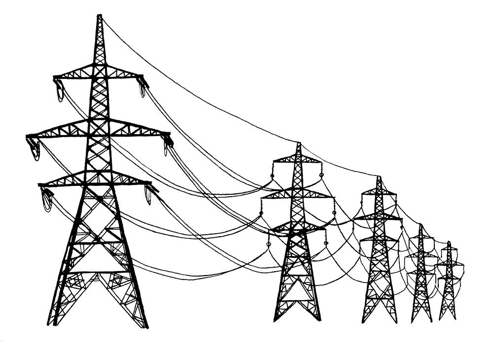

# **Lei de Joule e Linhas de Transmissão**  

**Fundamentos de Eletromagnetismo (UFMG)** 

**Semestre 2020/2** 

**Turma TN1 - Prof. Carlos Heitor** 

Esse trabalho tem como objetivo explicar os principais conceitos relacionados à potência elétrica, efeito Joule e linhas de transmissão. Para ilustrar, será resolvida uma questão que engloba os conceitos discutidos e nos proporciona um entendimento, prático e aplicado desses conceitos em um cenário de distribuição de energia por linhas de transmissão.

Use as abas de navegação a cima, para acessar o conteúdo!

## TEMA 2 - GRUPO 16
## Integrantes:

* Stephanie Ogando 
* Paula Rodrigues 
* Pedro Silva

### 

